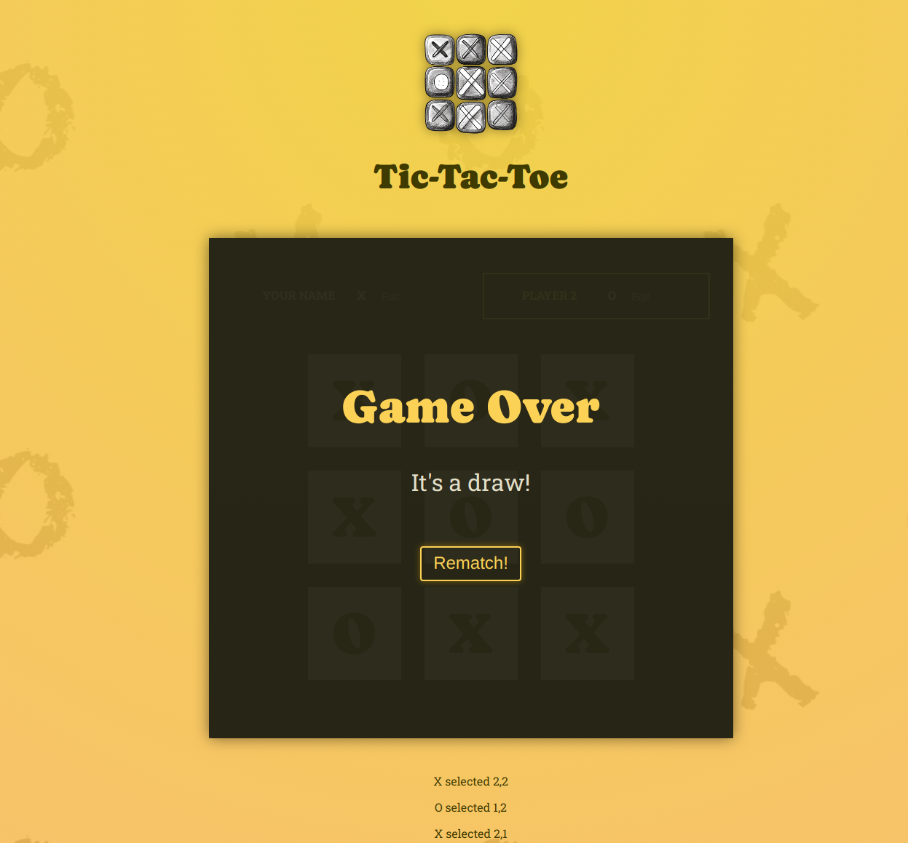
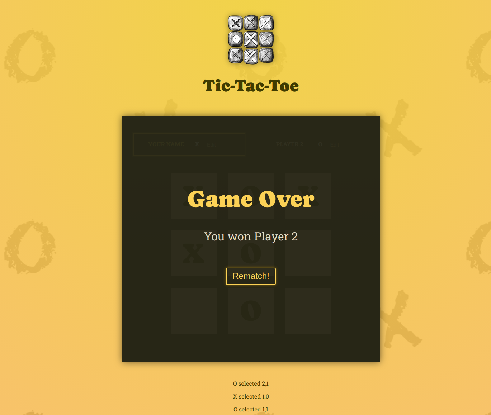

# Tic Tac Toe

This is a classic Tic Tac Toe game built with React. The game features a simple and intuitive interface, allowing two players to compete against each other in a turn-based manner. Designed with a modern look and responsive design, this game can be played on both desktop and mobile devices.
## Features

- Interactive Gameplay: Click to place your mark (X or O) and take turns with your opponent.
- Winner Detection: The game automatically detects and announces the winner or declares a draw.
- Reset Functionality: Easily reset the game board to start a new game.
- Responsive Design: Enjoy the game on any device, with a layout that adapts to different screen sizes.

## Tech Stack

**React:** For building the user interface and managing state. 

**JavaScript:** Core logic for the game.

**CSS:** Styling the game board and making it responsive. 
## Screenshots

## Deployment

- Clone the repository: git clone https://github.com/ShanuJo/React_TicTacToe.git
- Navigate to the project directory: cd tic-tac-toe-react
- Install dependencies: npm install
- Start the development server: npm start
- Open your browser and go to http://localhost:5173